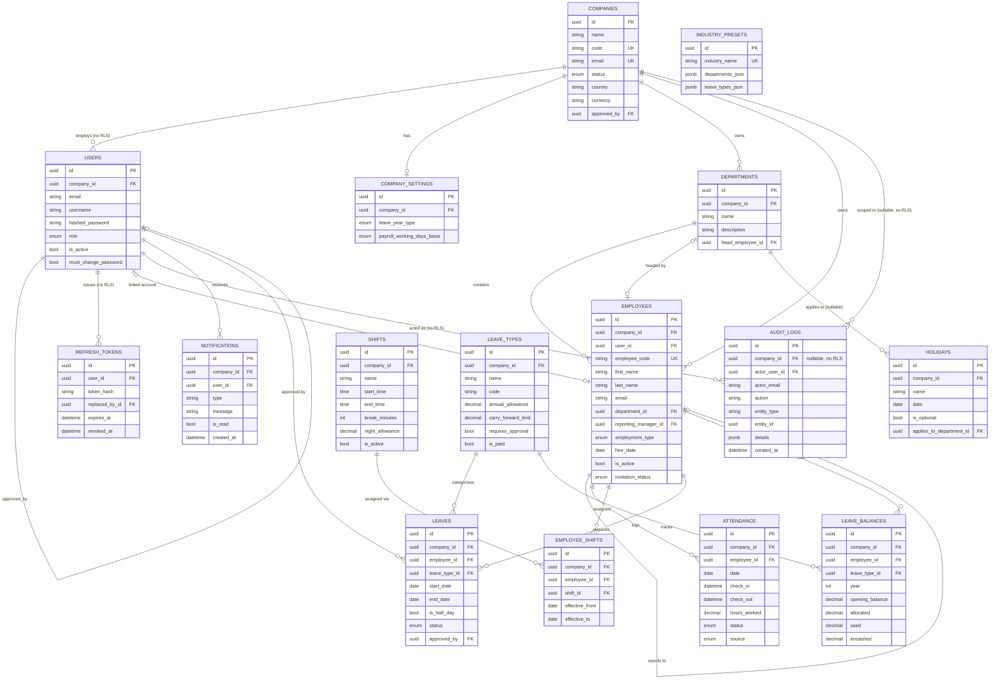

# Entity-Relationship Diagram

Every table currently in the schema (WP-01 through WP-14), grouped by module. Tables
without a shaded RLS note inherit `TenantBase` and carry an RLS policy scoped to
`company_id`; the three called out below are the deliberate exceptions (Spec §8, §7.2)
and are scoped in the repository layer instead — see the README's "Multi-tenancy and
row-level security" section for why.

`payroll_items`, `salary_structures`, `statutory_configs`, `performance_*` and
`project_*` tables are specified (Spec §9, §12) but not yet built — WP-16 through
WP-25 haven't run. They're omitted here rather than drawn as empty boxes.

`INDUSTRY_PRESETS` is platform-level reference data (no `company_id`, seeded once by
`scripts/setup.sh`) and has no relationship to any tenant table — it's read by the
company-registration form to suggest starter departments, not joined against.
