# Entity-Relationship Diagram

Every table currently in the schema across all 7 modules (WP-01 through WP-29), grouped by domain.
Tables inheriting `TenantBase` carry an active PostgreSQL Row-Level Security (`RLS`) policy scoped to `company_id`.
Tables without RLS (`companies`, `users`, `audit_logs`, `refresh_tokens`, `industry_presets`, `pt_slabs`, `tax_slabs`) are explicitly protected at the repository layer.

```mermaid
erDiagram
    %% Identity & Core HR
    COMPANIES ||--o{ USERS : "employs (no RLS)"
    COMPANIES ||--o| COMPANY_SETTINGS : has
    COMPANIES ||--o{ DEPARTMENTS : owns
    COMPANIES ||--o{ EMPLOYEES : owns
    COMPANIES ||--o{ AUDIT_LOGS : "scoped to (no RLS)"
    USERS ||--o| USERS : approved_by
    USERS ||--o{ REFRESH_TOKENS : "issues (no RLS)"
    USERS |o--o| EMPLOYEES : "linked account"
    USERS ||--o{ NOTIFICATIONS : receives
    DEPARTMENTS ||--o{ EMPLOYEES : contains
    DEPARTMENTS |o--o| EMPLOYEES : "headed by"
    EMPLOYEES ||--o| EMPLOYEES : "reports to"

    %% Time & Leave
    DEPARTMENTS ||--o{ HOLIDAYS : "applies to (nullable)"
    EMPLOYEES ||--o{ ATTENDANCE : logs
    EMPLOYEES ||--o{ EMPLOYEE_SHIFTS : "assigned"
    EMPLOYEES ||--o{ LEAVES : requests
    EMPLOYEES ||--o{ LEAVE_BALANCES : has
    SHIFTS ||--o{ EMPLOYEE_SHIFTS : "assigned via"
    LEAVE_TYPES ||--o{ LEAVES : categorizes
    LEAVE_TYPES ||--o{ LEAVE_BALANCES : tracks

    %% Payroll
    COMPANIES ||--o| STATUTORY_CONFIGS : configures
    COMPANIES ||--o{ SALARY_STRUCTURES : defines
    SALARY_STRUCTURES ||--o{ SALARY_COMPONENTS : contains
    EMPLOYEES ||--o{ EMPLOYEE_SALARIES : assigned
    SALARY_STRUCTURES ||--o{ EMPLOYEE_SALARIES : uses
    COMPANIES ||--o{ PAYROLL_RUNS : executes
    PAYROLL_RUNS ||--o{ PAYROLL_ITEMS : contains
    EMPLOYEES ||--o{ PAYROLL_ITEMS : calculates
    EMPLOYEES ||--o{ REIMBURSEMENTS : submits
    PAYROLL_ITEMS ||--o{ REIMBURSEMENTS : settles

    %% Performance
    COMPANIES ||--o{ PERFORMANCE_CYCLES : schedules
    PERFORMANCE_CYCLES ||--o{ PERFORMANCE_GOALS : tracks
    EMPLOYEES ||--o{ PERFORMANCE_GOALS : assigned
    PERFORMANCE_CYCLES ||--o{ PERFORMANCE_REVIEWS : reviews
    EMPLOYEES ||--o{ PERFORMANCE_REVIEWS : evaluated

    %% Projects & Timesheets
    COMPANIES ||--o{ PROJECTS : manages
    PROJECTS ||--o{ PROJECT_MEMBERS : includes
    EMPLOYEES ||--o{ PROJECT_MEMBERS : participates
    PROJECTS ||--o{ TASKS : contains
    PROJECTS ||--o{ MILESTONES : tracks
    TASKS ||--o{ TASK_COMMENTS : receives
    EMPLOYEES ||--o{ TASKS : assigned
    TASKS ||--o{ TIME_ENTRIES : logs
    EMPLOYEES ||--o{ TIME_ENTRIES : tracks

    %% Platform Services
    COMPANIES ||--o{ ANNOUNCEMENTS : posts
    EMPLOYEES ||--o{ EMPLOYEE_DOCUMENTS : owns
    FILE_OBJECTS ||--o| EMPLOYEE_DOCUMENTS : stores

    COMPANIES {
        uuid id PK
        string name
        string code UK
        string email UK
        enum status
        string country
        string currency
        uuid approved_by FK
    }
    USERS {
        uuid id PK
        uuid company_id FK
        string email
        string username
        string hashed_password
        enum role
        bool is_active
        bool must_change_password
    }
    REFRESH_TOKENS {
        uuid id PK
        uuid user_id FK
        string token_hash
        uuid replaced_by_id FK
        datetime expires_at
        datetime revoked_at
    }
    COMPANY_SETTINGS {
        uuid id PK
        uuid company_id FK
        enum leave_year_type
        enum payroll_working_days_basis
    }
    DEPARTMENTS {
        uuid id PK
        uuid company_id FK
        string name
        string description
        uuid head_employee_id FK
    }
    EMPLOYEES {
        uuid id PK
        uuid company_id FK
        uuid user_id FK
        string employee_code UK
        string first_name
        string last_name
        string email
        uuid department_id FK
        uuid reporting_manager_id FK
        enum employment_type
        date hire_date
        bool is_active
        enum invitation_status
        enum resignation_status
        date resignation_date
        date last_working_date
    }
    ATTENDANCE {
        uuid id PK
        uuid company_id FK
        uuid employee_id FK
        date date
        datetime check_in
        datetime check_out
        decimal hours_worked
        enum status
        enum source
    }
    SHIFTS {
        uuid id PK
        uuid company_id FK
        string name
        time start_time
        time end_time
        int break_minutes
        decimal night_allowance
        bool is_active
    }
    EMPLOYEE_SHIFTS {
        uuid id PK
        uuid company_id FK
        uuid employee_id FK
        uuid shift_id FK
        date effective_from
        date effective_to
    }
    HOLIDAYS {
        uuid id PK
        uuid company_id FK
        string name
        date date
        bool is_optional
        uuid applies_to_department_id FK
    }
    LEAVE_TYPES {
        uuid id PK
        uuid company_id FK
        string name
        string code
        decimal annual_allowance
        decimal carry_forward_limit
        bool requires_approval
        bool is_paid
        bool is_encashable
    }
    LEAVES {
        uuid id PK
        uuid company_id FK
        uuid employee_id FK
        uuid leave_type_id FK
        date start_date
        date end_date
        bool is_half_day
        enum status
        uuid approved_by FK
    }
    LEAVE_BALANCES {
        uuid id PK
        uuid company_id FK
        uuid employee_id FK
        uuid leave_type_id FK
        int year
        decimal opening_balance
        decimal allocated
        decimal used
        decimal encashed
    }
    SALARY_STRUCTURES {
        uuid id PK
        uuid company_id FK
        string name
        string country
        string level
        bool is_active
    }
    SALARY_COMPONENTS {
        uuid id PK
        uuid structure_id FK
        string code
        string name
        enum type
        enum calculation_type
        decimal value
        enum percentage_of
        bool is_taxable
        bool is_statutory
    }
    EMPLOYEE_SALARIES {
        uuid id PK
        uuid company_id FK
        uuid employee_id FK
        uuid structure_id FK
        decimal ctc
        date effective_from
        date effective_to
    }
    STATUTORY_CONFIGS {
        uuid id PK
        uuid company_id FK
        bool pf_enabled
        decimal pf_employee_rate
        decimal pf_employer_rate
        decimal pf_wage_ceiling
        bool esi_enabled
        decimal esi_employee_rate
        decimal esi_employer_rate
        decimal esi_wage_ceiling
        bool pt_enabled
        string pt_state
        bool tds_enabled
        enum default_tax_regime
    }
    PT_SLABS {
        uuid id PK
        string state
        decimal income_min
        decimal income_max
        decimal monthly_amount
        int special_month
        decimal special_month_amount
        date effective_from
    }
    TAX_SLABS {
        uuid id PK
        string country
        string financial_year
        enum regime
        decimal min_income
        decimal max_income
        decimal rate_percent
        decimal cess_percent
    }
    PAYROLL_RUNS {
        uuid id PK
        uuid company_id FK
        int month
        int year
        enum status
        enum run_type
        string idempotency_key UK
        decimal total_gross
        decimal total_net
        decimal total_deductions
        decimal total_employer_cost
    }
    PAYROLL_ITEMS {
        uuid id PK
        uuid company_id FK
        uuid payroll_run_id FK
        uuid employee_id FK
        decimal ctc_snapshot
        decimal gross_salary
        decimal total_deductions
        decimal net_salary
        decimal employer_cost
        jsonb earnings_json
        jsonb deductions_json
        jsonb employer_contributions_json
    }
    REIMBURSEMENTS {
        uuid id PK
        uuid company_id FK
        uuid employee_id FK
        enum claim_type
        decimal amount
        date expense_date
        enum status
        uuid approved_by FK
        uuid payroll_item_id FK
    }
    PERFORMANCE_CYCLES {
        uuid id PK
        uuid company_id FK
        string title
        enum cycle_type
        date start_date
        date end_date
        enum status
    }
    PERFORMANCE_GOALS {
        uuid id PK
        uuid company_id FK
        uuid cycle_id FK
        uuid employee_id FK
        string title
        int weightage
        int progress_percentage
        enum status
    }
    PERFORMANCE_REVIEWS {
        uuid id PK
        uuid company_id FK
        uuid cycle_id FK
        uuid employee_id FK
        uuid reviewer_id FK
        enum review_type
        decimal rating
        string comments
        bool is_submitted
    }
    PROJECTS {
        uuid id PK
        uuid company_id FK
        string name
        string code UK
        enum status
        date start_date
        date target_date
        decimal budget
    }
    PROJECT_MEMBERS {
        uuid id PK
        uuid project_id FK
        uuid employee_id FK
        enum role
        date joined_at
    }
    TASKS {
        uuid id PK
        uuid company_id FK
        uuid project_id FK
        string title
        enum status
        enum priority
        uuid assignee_id FK
        date due_date
        decimal estimated_hours
    }
    TASK_COMMENTS {
        uuid id PK
        uuid task_id FK
        uuid author_id FK
        string content
    }
    TIME_ENTRIES {
        uuid id PK
        uuid company_id FK
        uuid employee_id FK
        uuid project_id FK
        uuid task_id FK
        date entry_date
        decimal hours
        bool is_approved
    }
    MILESTONES {
        uuid id PK
        uuid project_id FK
        string title
        date due_date
        bool is_reached
    }
    ANNOUNCEMENTS {
        uuid id PK
        uuid company_id FK
        string title
        string content
        uuid author_id FK
        bool is_pinned
    }
    EMPLOYEE_DOCUMENTS {
        uuid id PK
        uuid company_id FK
        uuid employee_id FK
        string document_type
        string file_name
        string storage_key
        int file_size
        string mime_type
    }
    FILE_OBJECTS {
        uuid id PK
        uuid company_id FK
        string file_name
        string storage_path
        int file_size
        string mime_type
        uuid uploaded_by FK
    }
    AUDIT_LOGS {
        uuid id PK
        uuid company_id FK "nullable, no RLS"
        uuid actor_user_id FK
        string actor_email
        string action
        string entity_type
        uuid entity_id
        jsonb details
        datetime created_at
    }
    NOTIFICATIONS {
        uuid id PK
        uuid company_id FK
        uuid user_id FK
        string type
        string message
        bool is_read
        datetime created_at
    }
    INDUSTRY_PRESETS {
        uuid id PK
        string industry_name UK
        jsonb departments_json
        jsonb leave_types_json
    }
```

